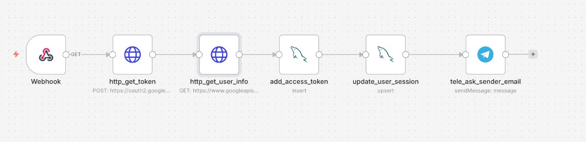
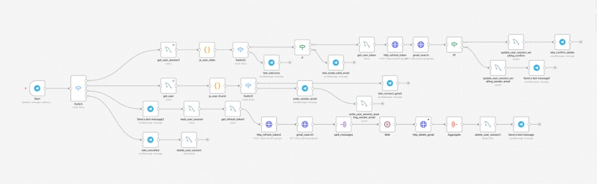

# Gmail Cleaner (n8n)

A Telegram bot built with n8n that helps users clean their Gmail inbox by searching for emails from a specific sender and deleting them. It uses Google OAuth2 for Gmail access, MySQL for storing tokens and sessions, and Telegram for the conversation interface.

**The service is live.** Anyone can use the bot on Telegram: [**@xrayon_bot**](https://t.me/xrayon_bot) — open the link in Telegram to start cleaning your Gmail by sender.

## Overview

- **Get Token workflow:** Handles the OAuth2 callback from Google, exchanges the code for tokens, fetches user info, stores credentials in MySQL, updates the user session, and asks the user (via Telegram) for the sender email to clean.
- **Main Cleaner workflow:** Triggered by Telegram messages and callbacks. Branches by user state/mode to welcome users, connect Gmail, collect sender email, search Gmail, confirm and perform deletions, or handle cancellation—with session and token refresh along the way.

## Prerequisites

- **n8n** instance (e.g. self‑hosted or n8n cloud)
- **MySQL** database for `users` (tokens, Gmail) and `sessions` (chat state)
- **Telegram Bot** (BotFather) and Telegram credentials in n8n
- **Google Cloud project** with OAuth2 client (Gmail API), redirect URI pointing to your n8n webhook URL for the get-token flow

## Workflows

### 1. Get Token (OAuth2 callback)

This workflow is triggered when Google redirects the user back to your n8n webhook after they authorize Gmail access.

1. **Webhook** – Receives the OAuth2 callback (e.g. `GET /webhook/gmail-callback?code=...&state=...`).
2. **http_get_token** – `POST` to `https://oauth2.googleapis.com/token` to exchange the `code` for `access_token` and `refresh_token`.
3. **http_get_user_info** – `GET` to `https://www.googleapis.com/oauth2/v2/userinfo` with the access token to fetch the user’s email/profile.
4. **add_access_token** – Inserts (or updates) the user in the `users` table: `chat_id`, `gmail`, `refresh_token`, `access_token`, `token_expiry`.
5. **update_user_session** – Upserts the `sessions` table for this `chat_id` and sets state (e.g. `awaiting_sender_email`).
6. **tele_ask_sender_email** – Sends a Telegram message asking the user to enter the sender email address to delete.

### 2. Main Cleaner (Telegram bot)

This workflow is triggered by Telegram updates (messages and callback queries). It routes by mode/state and orchestrates session lookup, token refresh, Gmail search, confirmation, and deletion.

- **Trigger:** Telegram “Updates: message, callback_query”.
- **Switch (mode):** Branches into:
  - **User session path** – `get_user_session` → `is_user_state` → further switch to welcome, or get token → `http_refresh_token` → `gmail_search` → `if` (e.g. valid email) → `update_user_session_av` + `tele_confirm_delete` or `tele_crete_validEmail` / sender_email handling.
  - **User found path** – `get_user` → `is_user_found` → switch to `tele_connect_gmail`, or `enter_sender_email` → `write_user_session_aval` → `gmail_search1` → `split_messages` → **Wait** → `http_delete_gmail` → **Aggregate** → `delete_user_session1` → “Send a test message”; or `get_refresh_token1` / `read_user_session` and `http_refresh_token2` then into the same Gmail search/delete flow.
  - **Cancel path** – `tele_cancelled` → `delete_user_session`.

Key ideas: session state drives the flow; tokens are refreshed when needed; Gmail is searched by sender, then messages are split, deleted via Gmail API, and session is cleaned up; the user gets feedback via Telegram at each step.

## Files

| File | Description |
|------|-------------|
| `gmail_access_token_webhook.json` | n8n workflow: OAuth2 callback → token + user info → DB + session → Telegram “ask sender email”. |
| `gmail-cleaner.json` | n8n workflow: Telegram-driven Gmail search and delete (simplified/alternate version). |
| `diagram-get-token.png` | Diagram of the Get Token workflow. |
| `diagram-main-cleaner.png` | Diagram of the Main Cleaner workflow. |

## Import and setup

1. In n8n, import each JSON workflow (Import from File or paste JSON).
2. Create and attach credentials:
   - **MySQL** – for `users` and `sessions` tables.
   - **Telegram API** – for the bot.
   - **Gmail OAuth2** – only if you use n8n’s Gmail node; the get-token workflow uses raw HTTP for the callback.
3. Configure the OAuth2 redirect URI in Google Cloud to your get-token webhook URL (e.g. `https://<your-n8n>/webhook/gmail-callback`).
4. Ensure the MySQL schema has `users` (e.g. `chat_id`, `gmail`, `refresh_token`, `access_token`, `token_expiry`) and `sessions` (e.g. `chat_id`, `state`, and any other fields your nodes use).
5. Activate the Get Token workflow so the webhook is live.
